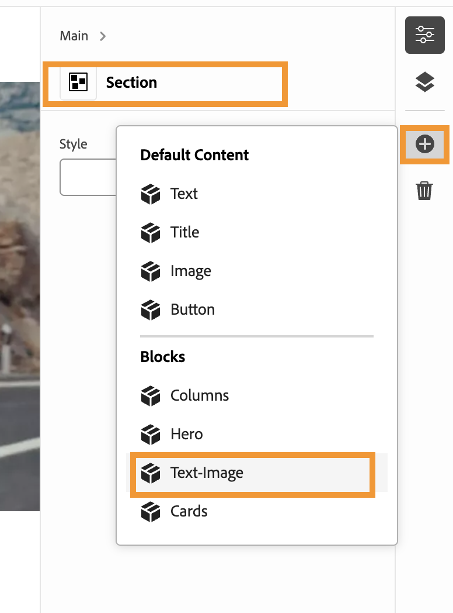
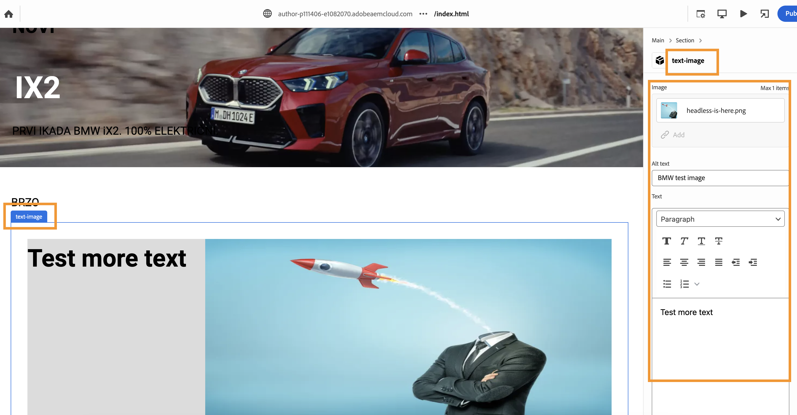

# Authoring Guide
***
**Access the Universal Editor**
***

1. The Universal editor can be accessed by the URL https://experience.adobe.com/#/@accentureemeaptrsd/aem/editor/canvas/
2. This is the base URL of the universal editor
3. This should be appended / suffixed with the author URL that is supported with the sandbox AEM that is enabled with universal editor
4. This may **_NOT_** work with a local AEM instance
5. Finally there is also a very easy way to access the universal editor, simply edit a page on the aem sites console of a universal editor enabled AEM instance

***
**Page Components**
***

1. There are no templates on the x-walk AEM instance
2. The Page on AEM consists a `main` that holds all other components within.
3. The main can have sections or other components
4. The Sections within main is easily identifiable from other sections by applying unique styles
5. A section can host any block , column or component within.
6. Within a section a newly created component can be authored by clicking the `+` icon to choose the block / component
   
7. Finally the component properties can be filled in the properties palette.
 

