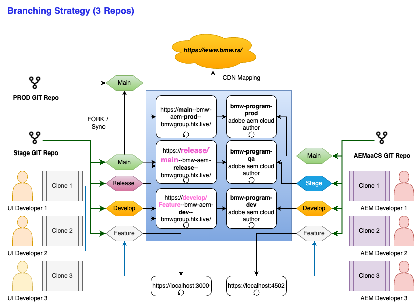

# How to Build & Test your code

## Front end code build

1. Create a new Feature Branch (checked out from develop / main branch) 
1. Follow the regular naming conventions for the feature branches / hotfix & more
2. Responsiveness is handled by making use of the media queries

## Pre-requisites to Preview / Publish content

1. Preview the content on the author's preview mode
1. Preview the content on the preview server 
1. Use the command below to generate the content & its modifications on the preview server

```sh

```curl -X POST https://admin.hlx.page/preview/Harish-deva/x-walk/feature-image-text/ -u xwalk-admin:JdAhR9hHeb5g8wK

## Key takeaways

1. The x-walk-admin user is a user who belongs to the Contributors User group 
1. The URL is of the pattern https://admin.hlx.page/preview/<<Repo-Owner>>/<<Repo-Name>>/<<Branch-Name>>/
    Where 
    - Repo-Owner : harish-deva  
    - Repo-Name : x-walk
    - Branch-Name : main / develop / feature/test-component
1. Kindly note that the branch name if contains '/' should be replaced with '-' if it must be previewed on a browser
1. Logs of Author / preview / publish can be requested individually.

## What is the branching strategy ?




