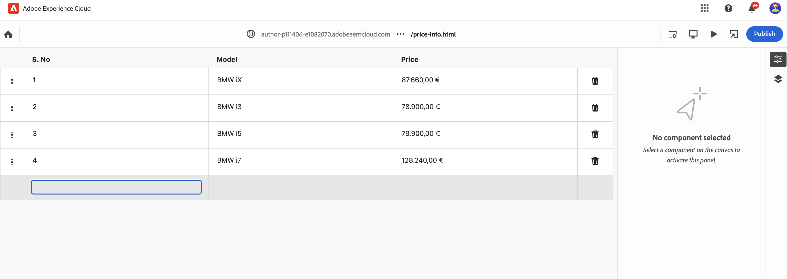
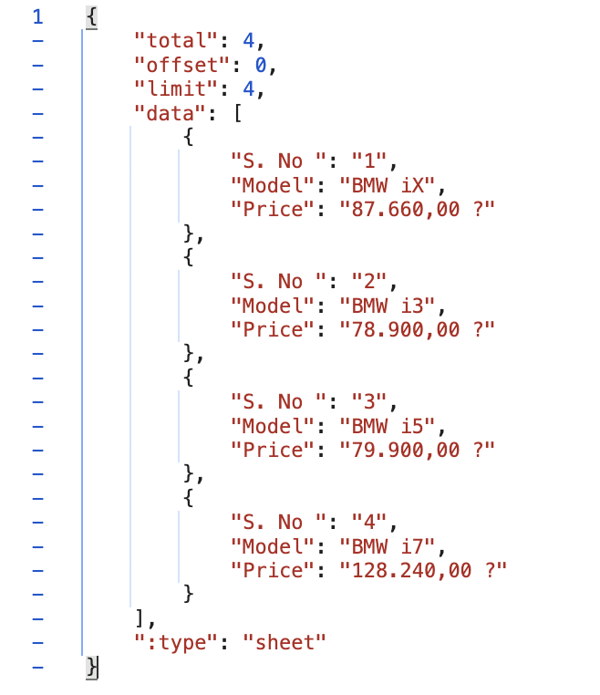

# Service API
***
**How to create consumable REST Service API / Spreadsheets**
***

1. Kindly refer the [documentation](https://www.aem.live/developer/spreadsheets) for reference
2. Create a Page on AEM with the `spreadsheet` template
3. Edit the page on the universal editor. Direct edit option may redirect to ~~universal~~ regular AEM editor.
4. Page post editing may look like the below
5. The data entered may not persist correctly. This issue shall be resolved in the upcoming releases.

***
**How to view spreadsheet contents as json to be consumed as a rest service**
***

1. Simply access this spreadsheet via the extension `.json` instead of `.html`
2. Kindly note that as per documentation the query parameters offset & limit is currently **NOT** working.It should be fixed in the upcoming releases.

