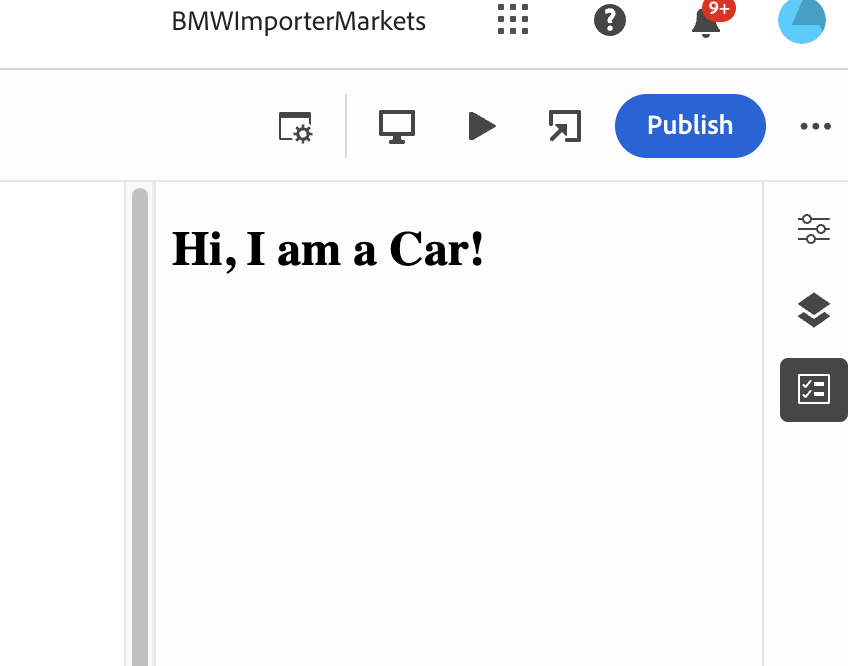
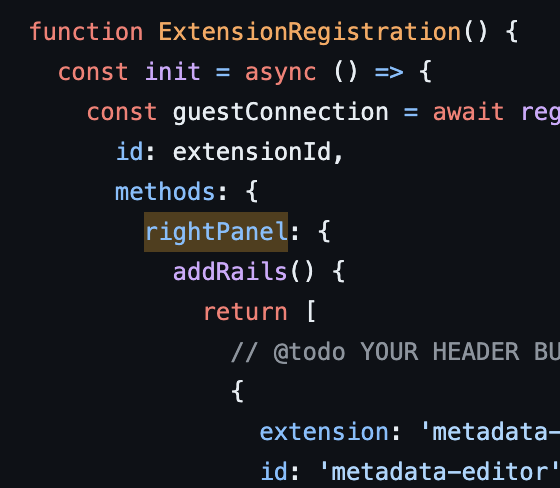

# Universal Editor Custom Plugin creation API
***
**How to create a custom plugins on Universal editor**
***

***
**Pre Requisites**
***

1. Basic Knowledge on React
2. Latest Yarn installed on the machine
3. Latest NPM installed on the machine
4. Git access to the Repo
5. Developer console access to AEM

***
**Installation steps**
***

1. Git clone the repo https://github.com/BMW-Importer/Metafox-UE-Extension.git
2. Navigate to the project folder on cmd / terminal to execute the command yarn
3. Upon successful execution a yarn.lock file gets auto generated & stored in the project folder.
4. install/update "aio" via npm install -g @adobe/aio-cli
5. on the developer console of the aem cloud instance download the json file (642WhiteBadger-1977741-Production.json) 
6. More info on the above to be shared by AEM SME's
7. store it on the Repo with the name config.json
8. run the command `aio app use config.json`
9. run the command `aio app run`
10. A localhost page should now open with the port no. 9080
11. open any page on AEMaaCS via the universal editor with the query parameter `?ext=https://localhost:9080/`
12. The page should now have the changes applied on the UE. 

***
**Code Walk through**
***

Review the Code  on  src/universal-editor-task-management/web-src/src/components/ExtensionRegistration.js
The Right panel (as seen on the screen shot below) makes sure that the extension is available on the UE right panel

Similar function can be written to add an extension on the header panel of the UE.
